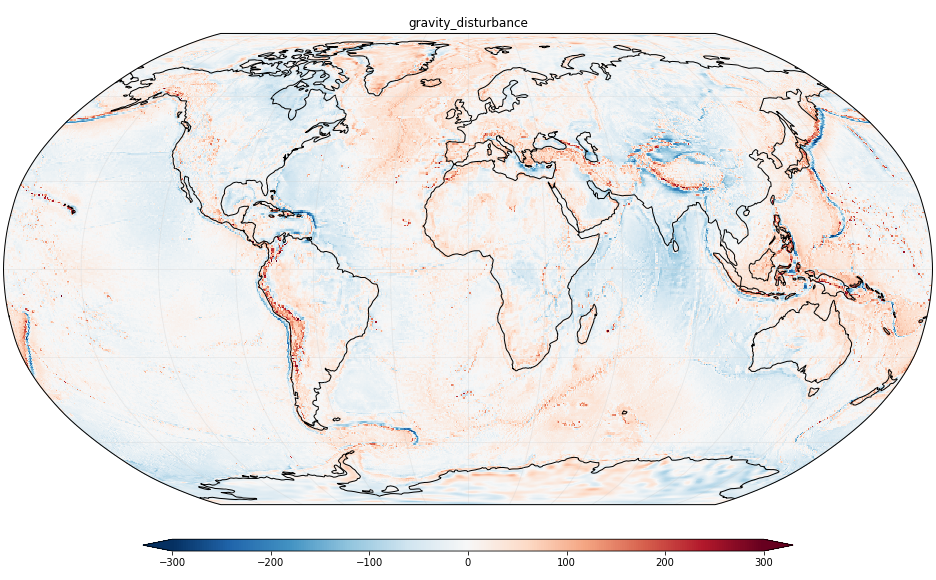

# The Gravity Disturbance

TODO: Short description

**Run the notebooks online:** 

## Concept

TODO

## Learning objectives

TODO

## Prerequisites

This lesson assumes basic knowledge of:

* The layering of the Earth (crust, mantle, core, lithosphere, asthanosphere)
  <[Wikipedia](https://en.wikipedia.org/wiki/Structure_of_the_Earth)>
  <[SEG wiki](https://wiki.seg.org/wiki/Layers_of_the_Earth)>
* The Earth gravity field (gravitational and rotational components) and Normal
  gravity

## Further reading

Where to go when you're done with this lesson.

## Data

Describe the data we'll use.

## The software

Describe the software.

How to run things online.

Install instructions to run things locally.

## For teachers

Where to find the lesson plan. How long this lesson will take.
[LESSON_PLAN.md](LESSON_PLAN.md).

## Getting Help and Contributing

Please read our [Contributing Guide](CONTRIBUTING.md) to see how you can request
help, contribute to this lesson, and give feedback.

This project is released with a [Code of Conduct](CODE_OF_CONDUCT.md). By
participating in this project you agree to abide by its terms.

### Imposter syndrome disclaimer

**We want your help.** No, really.

There may be a little voice inside your head that is telling you that you're
not ready to be a contributor; that your skills aren't nearly good enough to
contribute. What could you possibly offer?

We assure you that the little voice in your head is wrong.

**Being a contributor doesn't just mean writing code or extensive prose**.
Equality important contributions include: fixing typos and misspelled words,
suggesting or implementing small changes, or even giving feedback about the
project (including giving feedback about the contribution process). If you're
coming to the project with fresh eyes, you might see the errors and assumptions
that seasoned contributors have glossed over. If you can write any code at all,
you can contribute code to open source projects. We are constantly trying out
new skills, making mistakes, and learning from those mistakes. That's how we
all improve and we are happy to help others learn.

## License

You are free to reuse, share, and modify the contents of this lesson under the
terms of the Creative Commons Attribution 4.0 license and the BSD-3-clause
license (see [LICENSE.md](LICENSE.md) for details).
